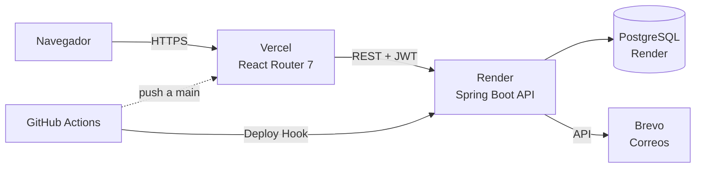

# Arquitectura

## Stack tecnológico

| Capa | Tecnología |
|---|---|
| Frontend | React 19 + React Router 7 (SSR-ready), Tailwind CSS 4, Recharts, Axios, Vite |
| Backend | Spring Boot 3.5 (Java 17), Spring Security + JWT (jjwt), Spring Data JPA |
| Base de datos | PostgreSQL (Render) — H2 en memoria para tests |
| Correo | Brevo (API transaccional) |
| Hosting | Frontend en **Vercel** · Backend y BD en **Render** |
| CI/CD | GitHub Actions (build, lint, tests, cobertura, deploy) |

## Diagrama general



## Estructura del repositorio

```
ProyectoSoftware/
├── backend/                  # API Spring Boot
│   └── src/main/java/com/proyectoarquitectura/app/
│       ├── controller/       # REST controllers por dominio
│       ├── service/          # Lógica de negocio (interfaces + impl)
│       ├── repository/       # Spring Data JPA
│       ├── models/           # Entidades JPA y DTOs
│       ├── security/         # JWT, filtros, UserDetails
│       ├── config/           # Security, Async, CORS, DataInitializer
│       └── exception/        # Excepciones y GlobalExceptionHandler
├── Front/proyecto-software-frontend/   # SPA React
│   └── app/
│       ├── pages/            # Vistas por rol (admin/, agent/, usuario)
│       ├── layouts/          # AppShell + layouts por rol
│       ├── components/       # Comunes y de admin (modales, campana, etc.)
│       ├── hooks/            # useDashboardData, etc.
│       ├── api/              # Cliente axios + wrapper apiFetch
│       └── services/         # ticketsService, authService...
├── .github/workflows/ci.yml  # Pipeline CI/CD
└── Documentacion/            # Documentos de la materia y esta wiki
```

## Decisiones de diseño relevantes

- **Autenticación**: JWT con access + refresh token; el frontend renueva el access token automáticamente con un interceptor de axios al recibir 401.
- **Autorización**: roles `usuario`, `agente`, `administrador` con `@PreAuthorize` en el backend y layouts separados por rol en el frontend.
- **Auditoría**: cada cambio relevante (roles, estados, tickets) queda en el historial (`ticket_history`) y en el log de auditoría.
- **Notificaciones por correo** (Brevo): creación de ticket, asignación a agente (notifica también al cliente) y cambios de estado. Envíos asíncronos (`@Async`) — si Brevo no está configurado, solo se registra en el log.
- **Variables de entorno** (backend): `JWT_SECRET`, `CORS_ALLOWED_ORIGINS`, `BREVO_API_KEY`, `BREVO_SENDER_EMAIL`, credenciales de BD. Frontend: `VITE_API_URL`.
