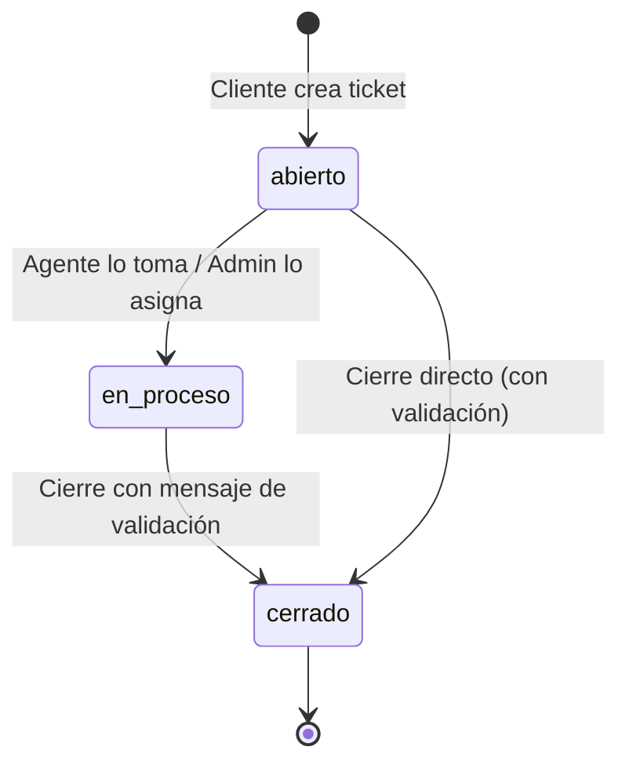

# Roles y Flujo de Tickets

## Roles del sistema

| Rol | Qué puede hacer |
|---|---|
| **Usuario (cliente)** | Crear tickets, ver los suyos, comentar, recibir notificaciones por correo |
| **Agente** | Ver la cola general, tomar tickets (auto-asignarse), atender sus asignados, comentar, cambiar estados, cerrar con validación |
| **Administrador** | Todo lo anterior + gestión de usuarios/roles/estados, asignación de tickets a agentes, categorías, SLA, métricas, auditoría, exportes y configuración |

## Ciclo de vida de un ticket

1. **Creación**: el cliente crea el ticket (asunto, descripción, tipo, prioridad, categoría). Nace `abierto` y **sin agente**. Se le envía correo de confirmación.
2. **Asignación** (manual, dos caminos):
   - El **administrador** asigna desde el modal de asignación, que sugiere un agente recomendado según área y carga actual (% de match) — pero la decisión es del admin.
   - El **agente** se auto-asigna desde la cola de tickets o el detalle.
   - En ambos casos se notifica por correo al agente y al cliente, y queda en el historial.
3. **Atención**: el agente cambia el estado a `en_proceso`, agrega comentarios/notas que quedan en el historial de actividad.
4. **Cierre**: requiere **confirmación con mensaje de validación** obligatorio, que se registra como comentario ("Validación y cierre del caso: …") antes del cambio de estado. Se notifica al cliente por correo y se registra `fechaCierre` para las métricas de SLA.

## SLA y tickets en riesgo

- Cada ticket puede tener `fechaVencimientoSla`; el dashboard del administrador muestra los **tickets en riesgo** ordenados por vencimiento (rojo < 1 hora, ámbar el resto, "Vencido hace X" si ya pasó).
- El KPI "SLA cumplido" se calcula como % de tickets cerrados antes de su vencimiento.

## Estados de usuario

`pendiente` (registro sin verificar) → `activo` (verificó correo o el admin lo aprobó) · `suspendido` · `rechazado` · `eliminado` (borrado lógico). El admin gestiona estas transiciones desde **Gestión de usuarios** (Aprobar/Rechazar, Suspender/Reactivar, Borrar).
